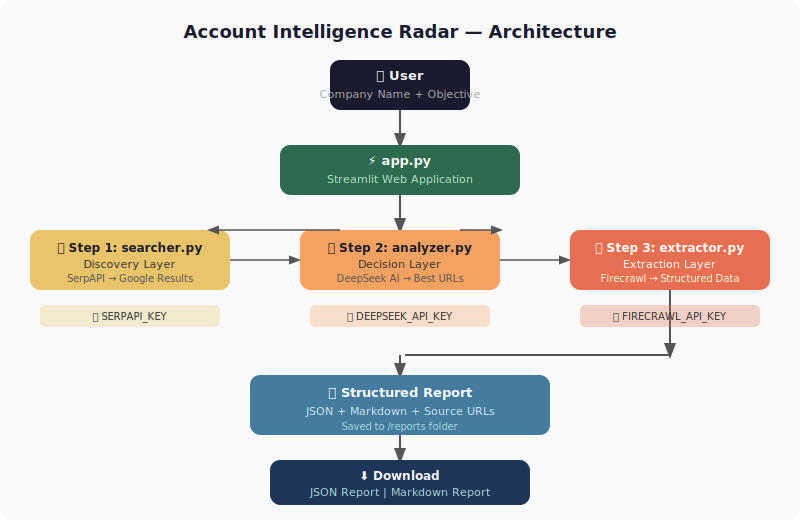

# Account Intelligence Radar

I built this project as part of my training at Averroa.

The idea came from a real problem — when you need to research
a company before a meeting or outreach, you waste a lot of time
searching manually. This tool reduces that time to minutes.

---

## What Does It Do?

You type a company name, and the tool:
- Searches Google automatically
- Uses AI to pick the best sources
- Extracts a structured report with:
  - Company headquarters and basic info
  - Business units and products
  - Executives (from official sources only)
  - Recent strategic initiatives
  - Source URLs as evidence for every claim

There is also a Geography Mode — you type a city and sector
and it returns a list of companies to target.

---

---

## Architecture



account-intelligence-radar/
├── app.py
├── searcher.py
├── analyzer.py
├── extractor.py
├── requirements.txt
├── .env
├── .env.example
├── .gitignore
├── README.md              
├── CONSULTANT_SUMMARY.md  
├── architecture.svg       
└── reports/
    ├── saudi_aramco_*.json 
    ├── saudi_aramco_*.md   
    ├── sabic_*.json        
    └── sabic_*.md          

---


## APIs I Used

Three APIs working together:

1. **SerpAPI** — to search Google programmatically
2. **DeepSeek AI** — to select the best URLs
3. **Firecrawl** — to extract data from websites

---

## Requirements

- Python 3.10 or newer
- SerpAPI account — serpapi.com
- DeepSeek account — platform.deepseek.com
- Firecrawl account — firecrawl.dev

---

## How To Run

### 1. Activate the virtual environment
```powershell
venv\Scripts\activate
```

### 2. Install dependencies
```powershell
python -m pip install -r requirements.txt
```

### 3. Set up your API keys

Copy `.env.example` and rename it to `.env`:
```powershell
copy .env.example .env
```

Open `.env` and add your keys:
```
SERPAPI_KEY=your_serpapi_key_here
DEEPSEEK_API_KEY=your_deepseek_key_here
FIRECRAWL_API_KEY=your_firecrawl_key_here
```

### 4. Run the app
```powershell
streamlit run app.py
```

Open your browser at: `http://localhost:8501`

---

## How To Use

### Company Mode
1. Open the **Company Mode** tab
2. Type a company name — for example `Saudi Aramco`
3. Type what you want to know — for example `Extract headquarters, business units, key executives, and recent strategic initiatives`
4. Click **Generate Report**
5. Download the report as JSON or Markdown

### Geography Mode
1. Open the **Geography Mode** tab
2. Type a location — for example `Riyadh, Saudi Arabia`
3. Type the sectors — for example `manufacturing, energy`
4. Click **Find Companies**
5. Copy any company name and use it in Company Mode


## Sample Outputs

In the `/reports` folder you can find real examples for two companies:
- Saudi Aramco — Saudi energy company
- SABIC — Saudi petrochemicals company

---

## Important Notes

- `.env` file is secret — never upload it to GitHub
- LinkedIn is not supported — their Terms of Service prohibit scraping
- Every claim in the report is linked to its source URL

---

## What I Would Improve Next

This is my first experience building this kind of project.
There are things I want to improve in the future:

- Better duplicate detection — right now I remove exact duplicates
  but not semantic ones (same meaning, different words)
- Full Geography Mode — right now it returns company names only,
  I want it to generate full reports automatically
- Caching — to reduce API calls and save cost
- Unit Tests — I did not have time for this in this project

---

*Seedra Helal — Fourth Year Information Technology Engineering Student, AI Specialization*
*Built during training at Averroa — March 2026*